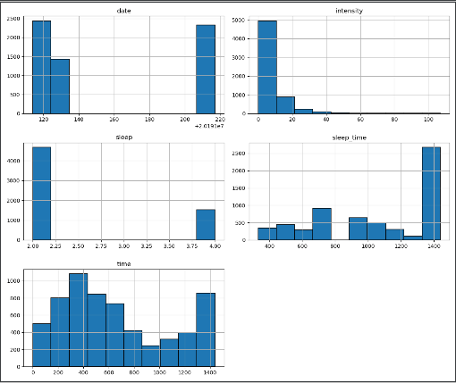

# AITask

제주대학교 인공지능 수업 최종과제입니다.

https://github.com/yungbyun/mllib의 classification_util.py, prediction_util.py를 사용하였습니다.

렘수면과 비렘수면을 구분하는 예시입니다.


전체 컬럼으로는 data(날짜), time(시간), sleep_time(자기 시작한 시간), intensity(운동 강도), sleep(수면 상태)가 존재합니다.

여기서 sleep이 예측 target으로 사용되었습니다.

원래 깨어있는 상태(1)와 장비를 착용하지 않은 상태(8)가 있지만 이 예시는 "너의 수면은" 어플과 똑같은 만들어졌기 때문에 순수하게 상태를 예측하기 보다 수면 상태 자체를 판별하도록 하기 위해 넣지 않았습니다.


아래는 위 파일을 통합한 util을 사용한 코드입니다.

```python
from classification_util import ClassificationUtil

gildong = ClassificationUtil()

gildong.ignore_warning()

gildong.read("../Data/sleepdata.csv") # 파일 읽기
gildong.show() # 데이터 형태 보기

gildong.myplot("sleep_time", "intensity", "sleep") # sleep을 범례로 사용한 그래프
gildong.pairplots(["sleep_time", "intensity", "sleep"], "intensity") # 색을 구분하는 플롯 - 예외로 인해 색은 제외
gildong.lmplot("sleep_time", "intensity", "sleep") # 기본 plot과 차이가 없어보임
gildong.myhist() # 각 컬럼에 따른 히스토그램 그리기
gildong.myviolinplot("sleep", "intensity") # intensity에 따른 바오올린플롯 그리기
gildong.heatmap() # 각 컬럼이 서로 얼마나 관계가 깊은지 확인하는 히트맵 그리고
gildong.boxplot("sleep", "intensity") # intensity에 따른 sleep 상태 보기, 바이올린플롯과 모양이 다름
gildong.plot_3d("sleep_time", "intensity", "sleep") # 컬럼의 데이터 분포를 3d로 시각화

# 서프트벡터머신(Support Vector Machine), 논리회귀(Logistic Regression), KNN(K Nearest Neighbors),
#   의사결정트리(Desicion Tree)의 4가지 머신러닝 알고리즘을 이용한 분류 
gildong.run(["date", "time", "sleep_time"], ["sleep"], 1)
```


다음은 그렸던 그래프입니다.

기본 plot


pairplot


lm plot


histogram




violin plot


heatmap


boxplot


3d plot


기본적으로 머신러닝으로 결과를 예측 또는 분류할 때에는

데이터를 불러와 최종 목표가 되는 타겟 컬럼을 지정하고

위처럼 여러 그래프들을 이용하여 각 컬럼간에 관계를 파악합니다

이 때 관계가 적어 예측이나 분류에 방해가 되는 컬럼은 제거합니다.


그 후 마지막으로 사용할 머신러닝 알고리즘을 선정하여 객체를 만들고

그 객체를 fit함수를 통하여 학습한후 predict함수로 예측(또는 분류)결과를 만들어냅니다.


실제 예측(또는 분류)를 할때에는 온 결과를 그대로 사용하고

그것이 아닌 알고리즘의 정확성을 판별할 때는accuracy_score함수로 점수로 확인합니다.


참고로 위 데이터를 바탕으로 intensity 불필요하다 판별하여 해당 컬럼을 제거하였고

제거 결과 예측 점수는 다음과 같습니다.

